## Exercise

In this exercise you will use QGIS to create a map showing the rate of pothole-related 311 complaints in New York City neighborhoods in 2026.

All of the data you need for this project is available freely online, and this document gives detailed instructions for retrieving it. Pre-packaged versions of the data files are also available in the [data folder for this exercise](data) if you'd rather skip the download/cleanup steps.

For this exercise we will use a neighborhood definition called "Neighborhood Tabulation Areas" (NTAs). NTAs are created by the NYC Dept. of City Planning and are aggregations of census tracts meant to approximate neighborhoods as they are popularly thought of by city residents. NTAs typically have around 40,000–50,000 residents.

NTAs are aggregations of census tracts. Census tracts are a neighborhood definition created by the US Census Bureau. Census tracts typically have around 3,000–5,000 people in them, and in densely populated areas they can be quite small. For example, here is a map of the tracts in the Columbia University area:

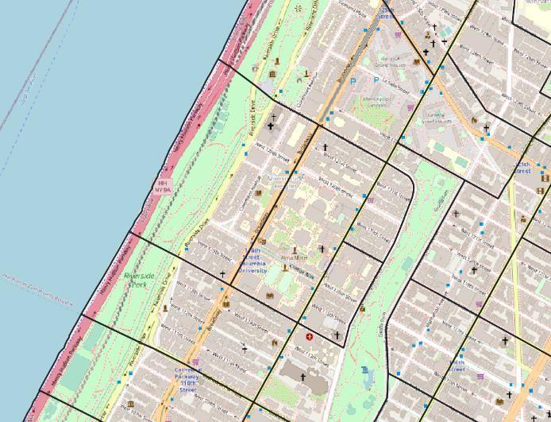

And here is the "Morningside Heights" NTA, composed of 8 of the census tracts above:

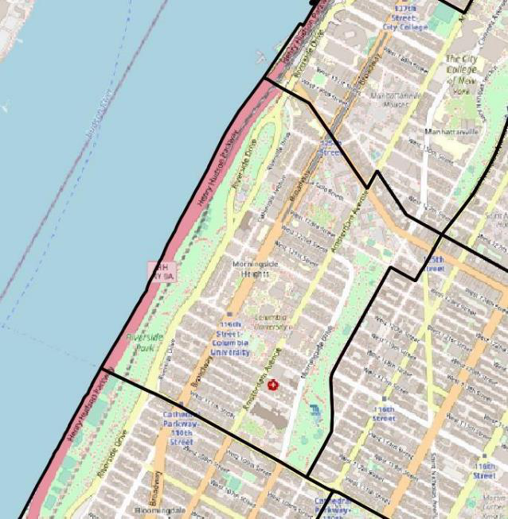

You will use QGIS to build NTA geographic definitions, population totals, and pothole complaint rates for the entire city.

## Get the tract geography

Census tracts are determined by the Census Bureau, which produces authoritative boundaries for them on a regular basis. There are also derivative boundary sources. You will use a modified tract file for NYC available from the [Geodata@Columbia](https://geodata.library.columbia.edu/catalog/columbia-cul-nyc-tracts-2020) home page:

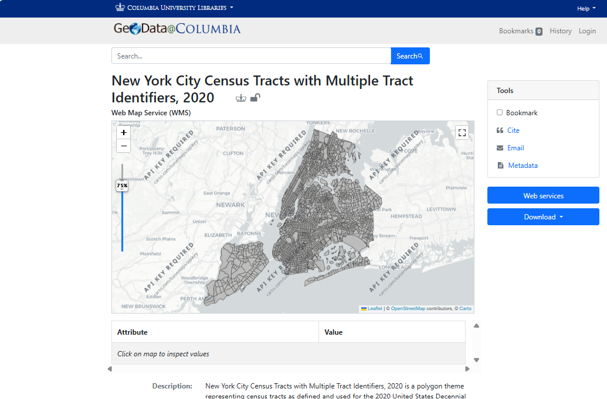

If you haven't already, create a directory to store all the files for this exercise, and store the geography download there. Unzip the tract geography file from Geodata. This file is in an open format called "geopackage" (`.gpkg`). Geopackages are a fast, convenient geospatial format that come as a single file. A more common vector GIS format is the "shapefile" — if you'd like to compare, a shapefile version of this layer is available from [NYC Planning](https://www.nyc.gov/content/planning/pages/resources/datasets/census-tracts):

With the data ready, open QGIS and create an empty map document.

One way to add the geopackage is through the Browser panel, which is likely docked to the left side of QGIS. From there you can browse your computer's file directory. Expand the directory structure to your working directory, then click and drag the geopackage into the map window. The tracts will appear:

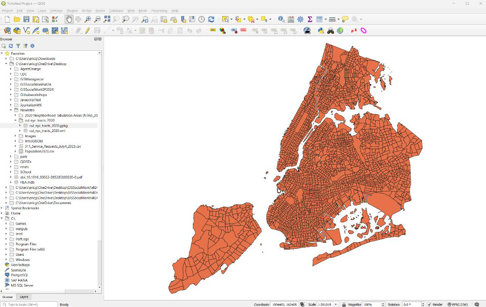

Note that the tracts appear in a random color — you can change this later. Next, inspect the layer attributes by right-clicking the layer name in the Layers panel and choosing "Open Attribute Table":

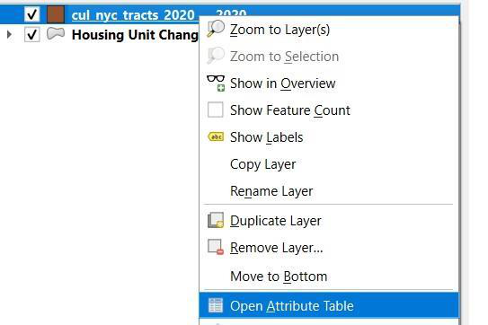

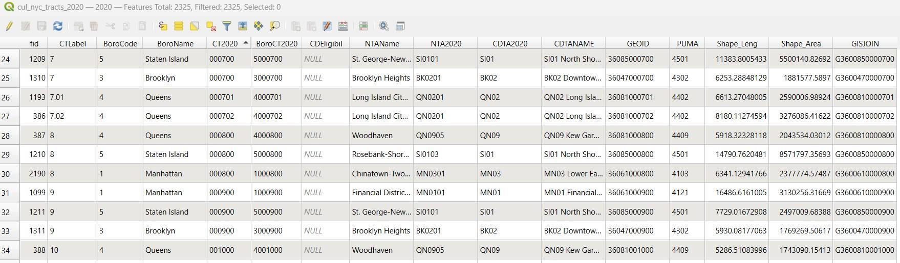

There is a variety of information for each tract. For our purposes the three important columns are **GEOID**, **NTA2020**, and **NTAName**. GEOID is the 11-digit "FIPS" identifier that uniquely identifies the tract. NTA2020 is the identifier for the NTA the tract belongs to (not unique — NTAs are comprised of multiple tracts). NTAName is the vernacular name of the NTA.

## Get the population data

Next you'll add population data. You can get current census tract population estimates directly from the Census Bureau website at [data.census.gov](https://data.census.gov/):

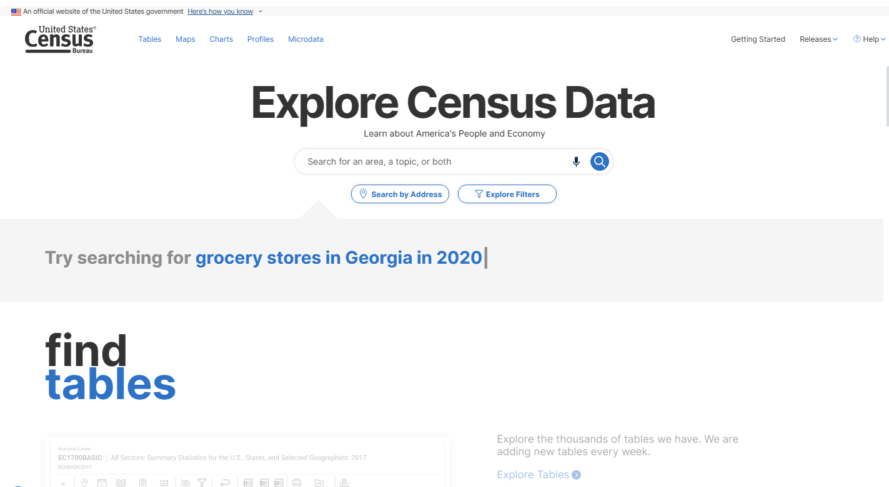

Choose "explore filters," select "Census Tract" as the geography level, then New York, and all the tracts for the five counties that comprise NYC (Bronx, Kings, New York, Queens, Richmond):

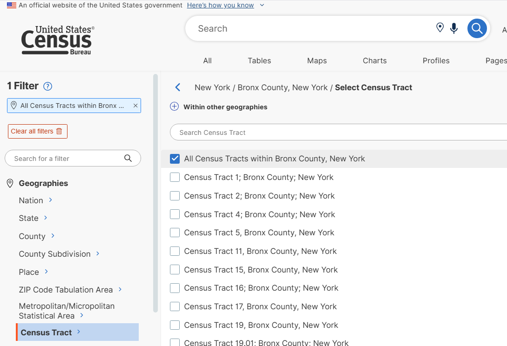

Choose the year 2024 (the most recent 5-year ACS release as of this writing):

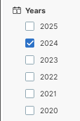

Choose the "Populations and People" topic, then "Counts, Estimates, and Projections":

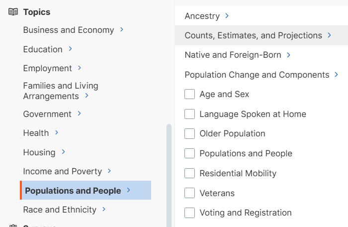

Click Population Total:

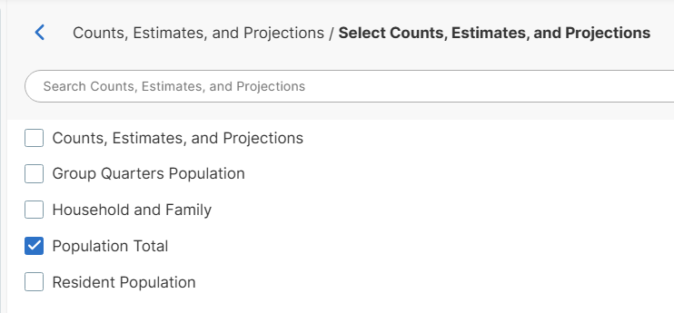

Search, and look for the TOTAL POPULATION table (B01003) in the results:

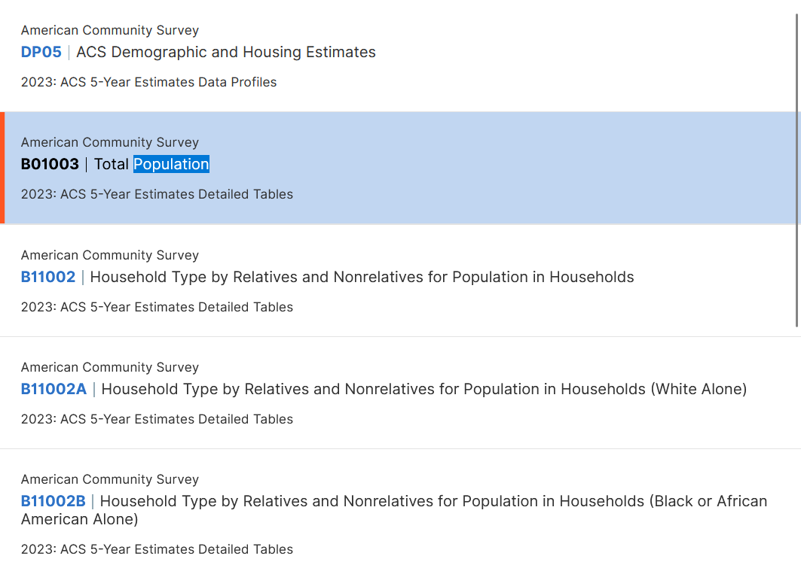

Download it, unzip the download package, and open the data file:

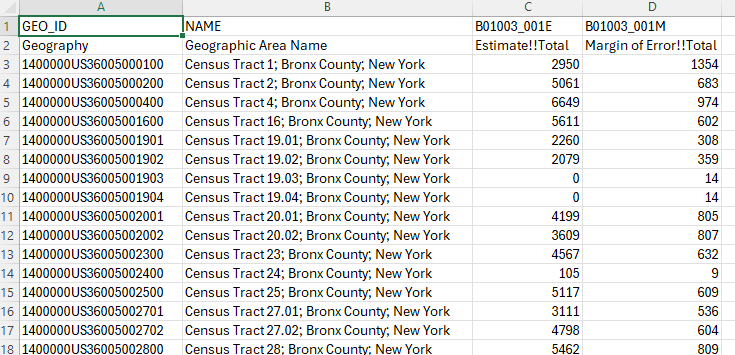

## Clean up the population table

Some cleanup is required. Delete the second row and all data columns except the first — you should end up with just the GEO_ID and total population estimate:

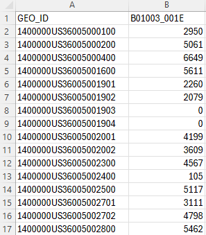

The GEO_ID field (the census FIPS code) needs to be trimmed to produce an appropriate join code — the correct code is the last 11 numerical digits (omitting the "1400000US" prefix). Insert a new column and enter the formula `=RIGHT(A2,11)` for the first value, then copy it down the rest of the column:

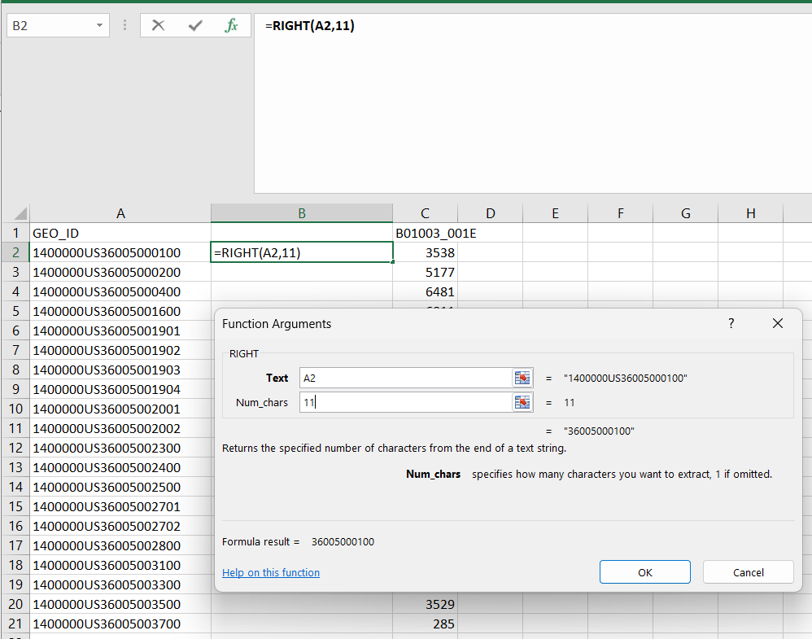

Copy that column and paste the values only (to remove the formula), then delete the original GEO_ID field. Rename the two remaining fields "FIPS" and "Population":

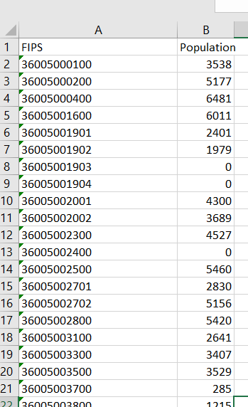

Save this as a CSV named `Population2024`.

## Join the population data in QGIS

Now add this data to QGIS. CSV files may not add properly from the Browser panel, so instead use the Data Source Manager 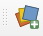 and choose the "Delimited Text" option. Specify that the table is a CSV and choose "No Geometry." The dialog will preview the data at the bottom:

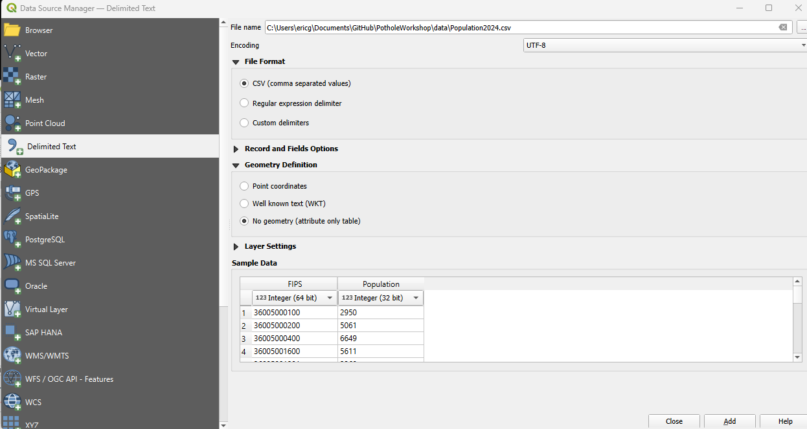

One change needs to be made here. QGIS will guess a data type for each field, and it will likely guess "integer" for FIPS since the column contains only numeric characters. This isn't appropriate — FIPS is a unique identifier, not a quantitative variable, so it's closer to a name. In the geopackage it's encoded as text/string, and both tables need to use the same data type to join. Change the FIPS field type to "Text (string)":

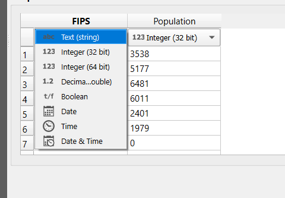

Click Add, then inspect the attribute table to make sure it looks correct:

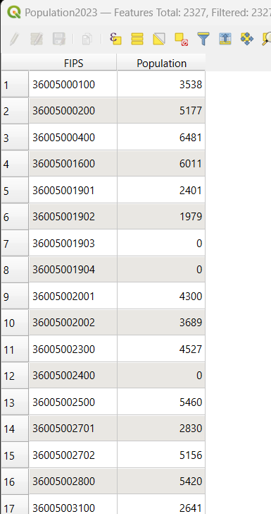

Since FIPS and GEOID are unique identifiers, you can join the CSV data to the geopackage using a table join. Open the layer properties for the tract geography by right-clicking it in the Layers panel:

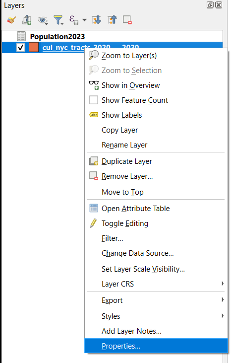

In the properties dialog, select the Joins tab:

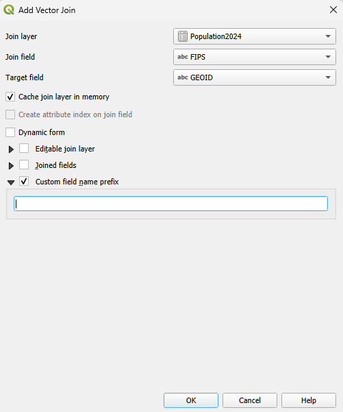

Click the add join button. Choose the CSV as the join layer, select the appropriate join field, and make sure the "Custom field name prefix" field is blank:

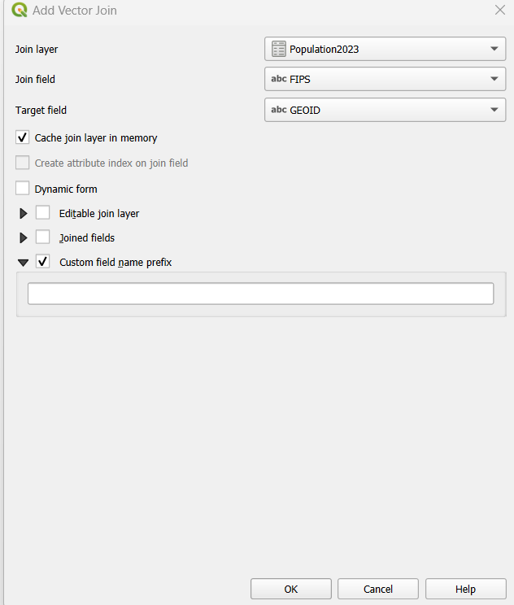

Click OK, then open the geopackage attribute table again — the population figure should now display at the end:

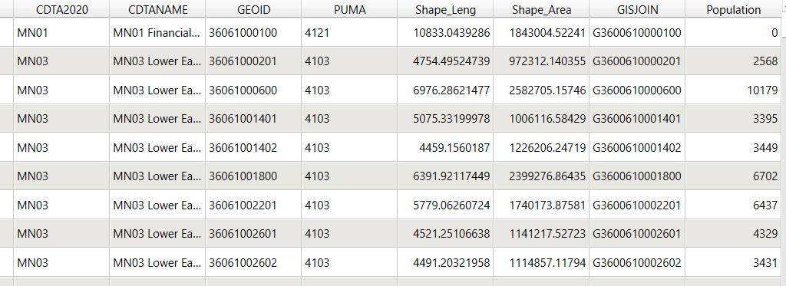

Since the table join is stored in memory, make it permanent by exporting the geography to a new layer. Right-click the tract layer entry and choose Export > Save Features As:

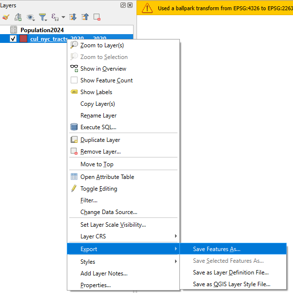

Save it in your working directory as a Geopackage named `TractsWithPopulation`:

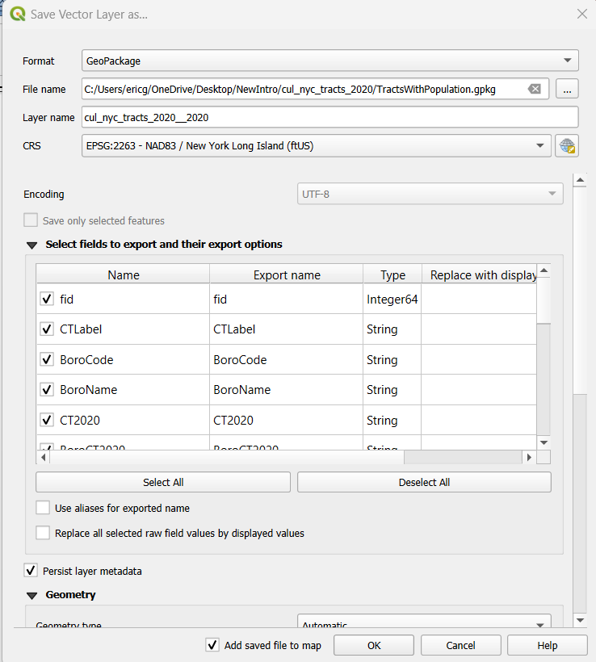

The new layer should appear in the map window. You no longer need the original geopackage or CSV — remove them by right-clicking in the Layers panel and choosing "Remove Layer."

## Build the NTA boundaries

The next step is to generate NTA boundaries using the attribute table. You can construct NTAs by merging the geographies of all tracts sharing the same NTA. The GIS term for this is "dissolve."

QGIS has several dissolve-type functions; the one you'll use is called "Aggregate." Find it in the Processing Toolbox:

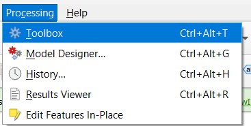

Search "dissolve" in the Processing panel — among the results, choose "Aggregate":

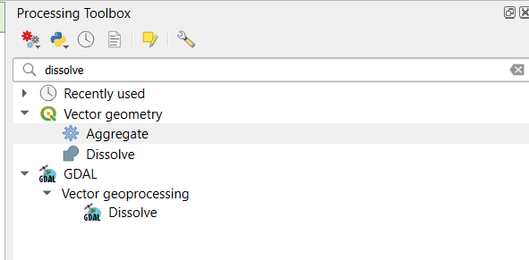

The Aggregate tool lets you perform arithmetic on variables as tracts are merged — important, since we want to sum the population field. In the Aggregate dialog, choose NTA2020 as the group field. For the NTA2020 and NTAName fields choose "first_value"; for the Population field choose "sum." You don't need the other fields and may delete them with the delete-field button. Save the output as a Geopackage named `NTAPopulation`:

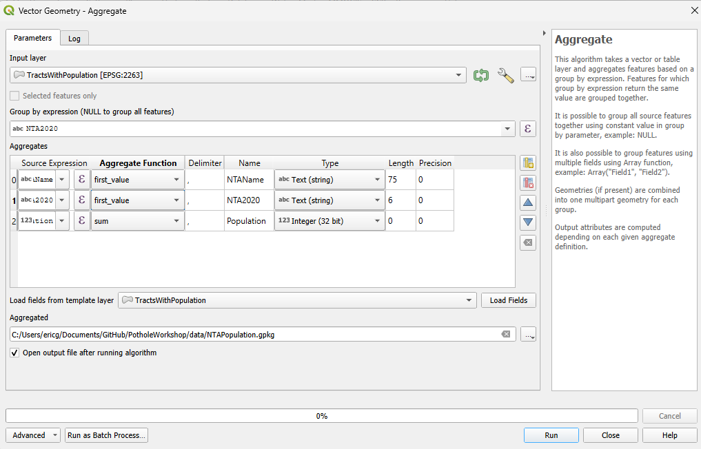

The output layer should appear in the map window, with boundaries now representing NTAs:

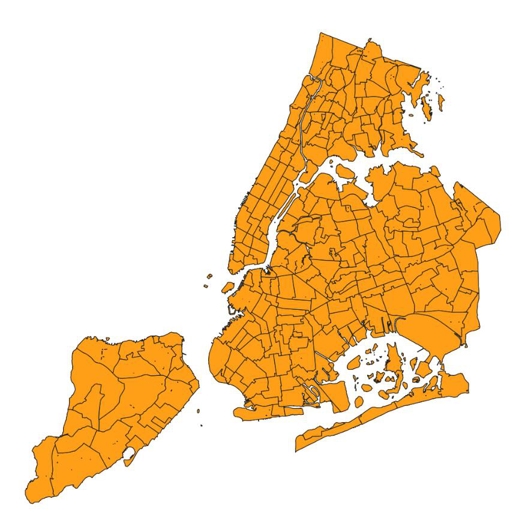

And the attribute table will have the population total:

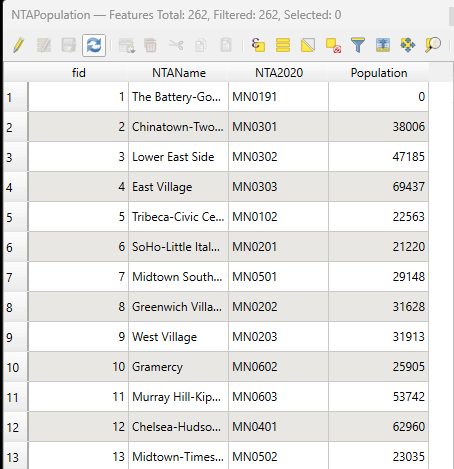

## Get the pothole complaint data

The next step is to retrieve the pothole complaint data. We'll use complaints logged to the city's 311 program, available at the [NYC Open Data Portal](https://data.cityofnewyork.us/Social-Services/311-Service-Requests-from-2010-to-Present/erm2-nwe9/about_data).

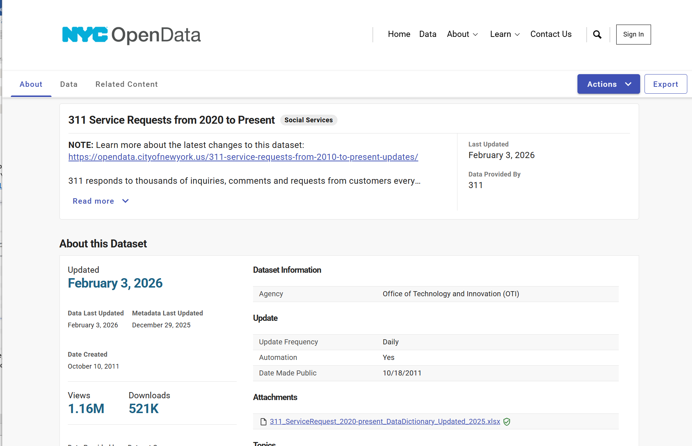

Since there are over 40 million calls in the full dataset, it's too unwieldy to download in full — query a subset instead. Click "Query Data" under Actions at the top of the page:

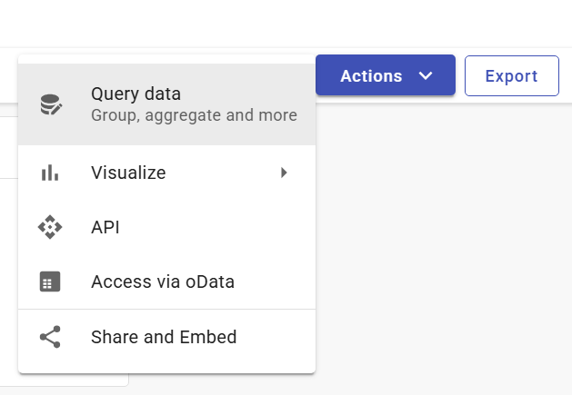

Apply filters:

- "Problem (formerly Complaint Type)" contains "street condition"
- AND "Problem Detail (formerly Descriptor)" contains "pothole"
- AND "Created Date" is between "2026 Jan 01 12:00:00 AM" AND "2026 Sep 01 12:00:00 AM"
- AND "Latitude" is not null

Then hit Apply:

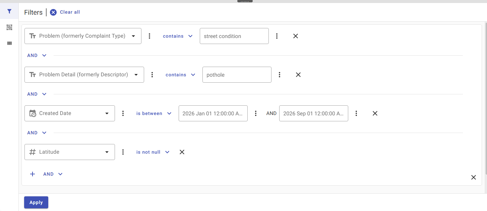

This should bring the results down to around 27,000 incidents. Download in CSV format.

The CSV includes coordinates for each incident, so you can map the table directly in QGIS. Open the Data Source Manager, click "Delimited Text," load the table you just downloaded, choose CSV as the file format, choose "Point coordinates" as the geometry definition, enter "longitude" and "latitude" as the X and Y fields, and make sure "EPSG:4326 – WGS 84" is selected as the geometry CRS (the default reference system for NYC Open Data):

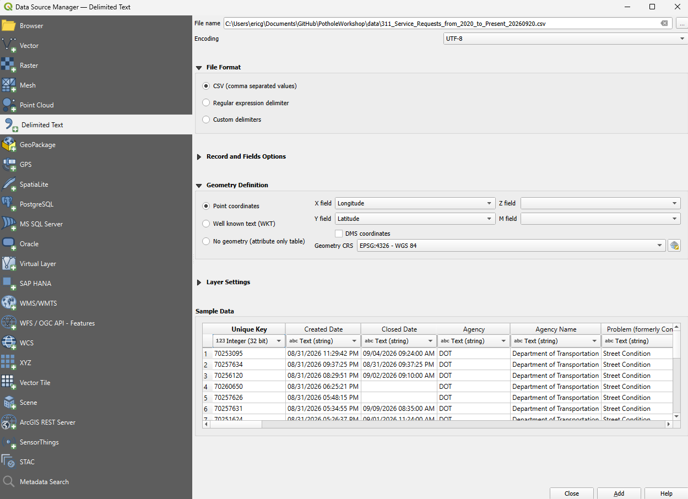

Click Add and close the dialog. The points should map onto the NTAs:

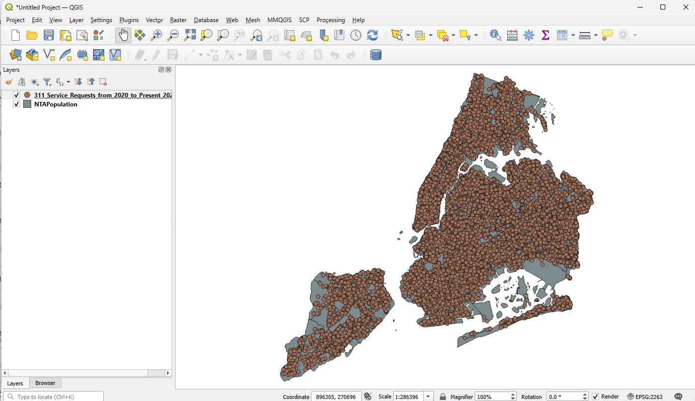

## Turn the points into a layer and count them per NTA

Right now these points are just a visual expression of the table's locations. To encode them as a proper geospatial dataset, export to a geospatial format. Right-click the table entry in the Layers panel, select Export, then Save Features As:

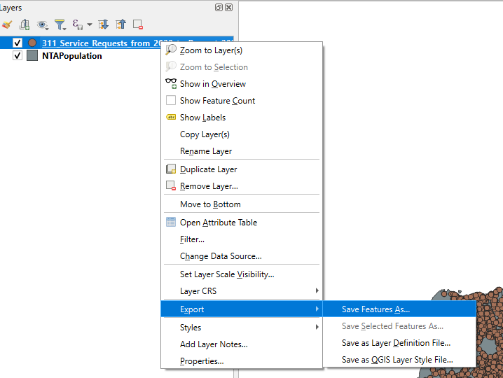

Export in Geopackage format to your working directory, naming the file `PotholeLocations`. It's recommended you also change the CRS to "EPSG:2263 – NAD83 / New York Long Island" to match the projection of the tract file:

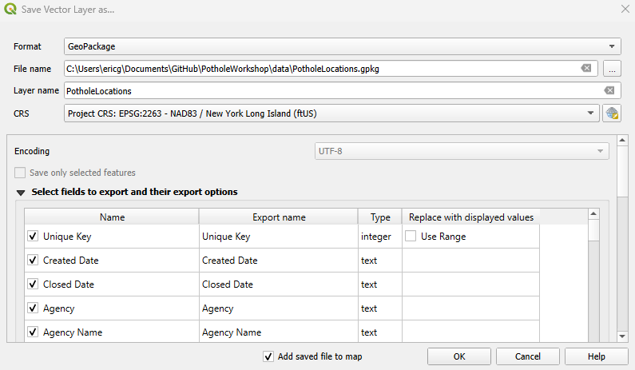

The new layer should look identical to the CSV expression — you can now remove the CSV from the project if you like.

Next, calculate the number of complaints per NTA. This requires a kind of spatial join. Under the Vector menu, in Analysis Tools, select "Count Points in Polygon":

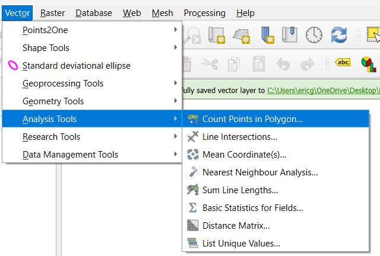

Choose the NTA layer as the polygons and PotholeLocations as the points. Name the count field "PotholeComplaints." Save the output as `NTA_PotholeTotals`:

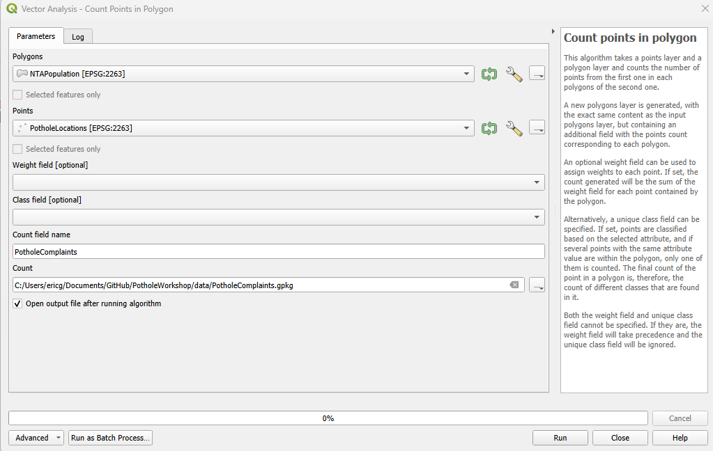

Click Run:

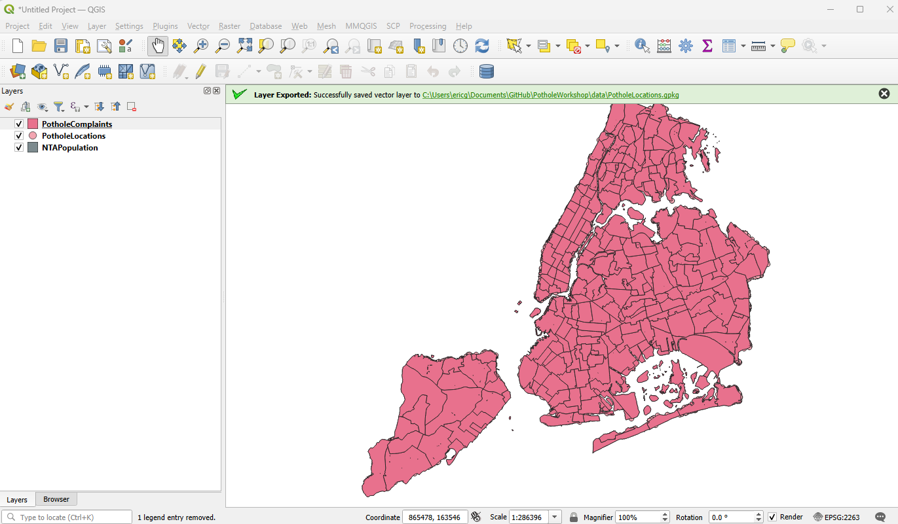

The attribute table for this layer will show the total number of complaints for each NTA:

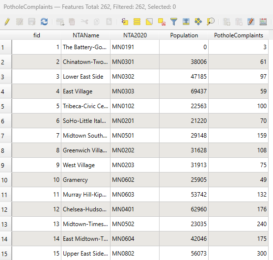

## Calculate the complaint rate and map it

Use the "Population" and "PotholeComplaints" fields to calculate the rate of complaints per population. From the attribute table, open the Field Calculator 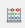. Choose "Create a new field," name the output field "PotholeRate," make the output field type "Decimal number," and enter the expression:

```
( "PotholeComplaints" / "Population" ) * 1000
```

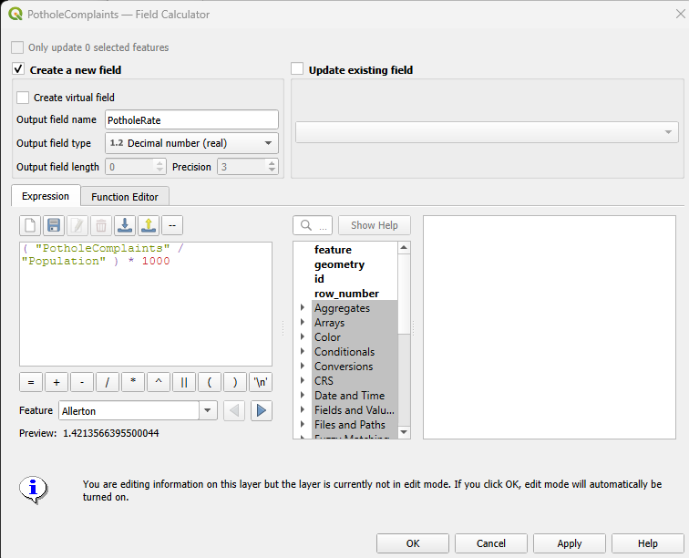

You can optionally click fields directly from "Fields and Values" in the center panel to make sure they're spelled precisely. Click OK — the new column gives the number of pothole-related complaints per 1,000 residents:

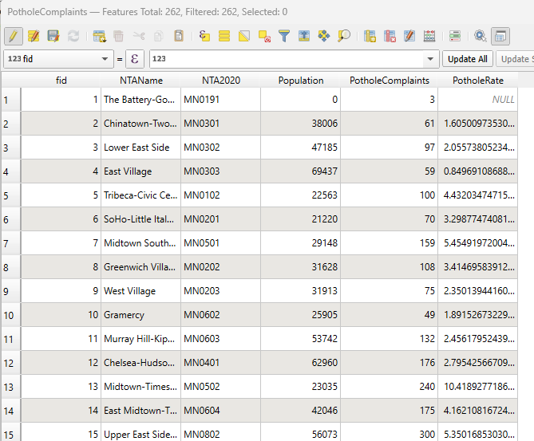

Running the Field Calculator automatically starts an editing session for the layer. End it now by toggling the Edit button .

Now build a choropleth map of the reporting rates. Remove any layers from the map except the final `NTA_PotholeTotals` layer. Open its layer properties, go to Symbology, choose a "Graduated" color scheme, and select PotholeRate as the value:

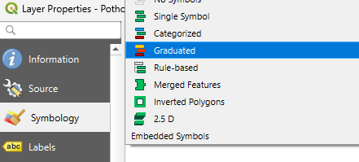

Choose a color ramp and a classification scheme, then click Classify:

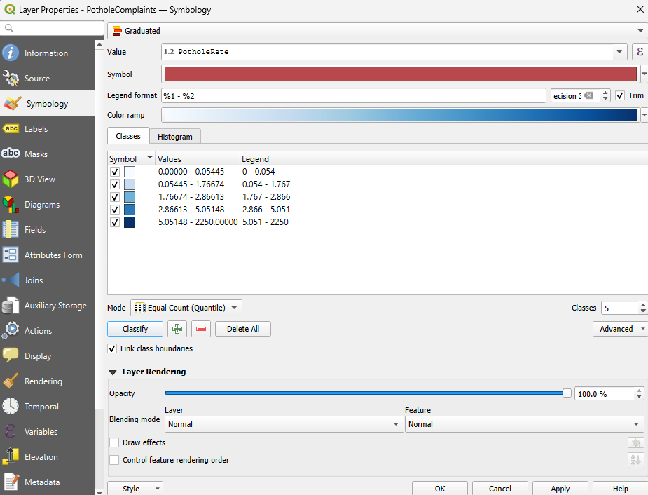

Click OK and inspect the results:

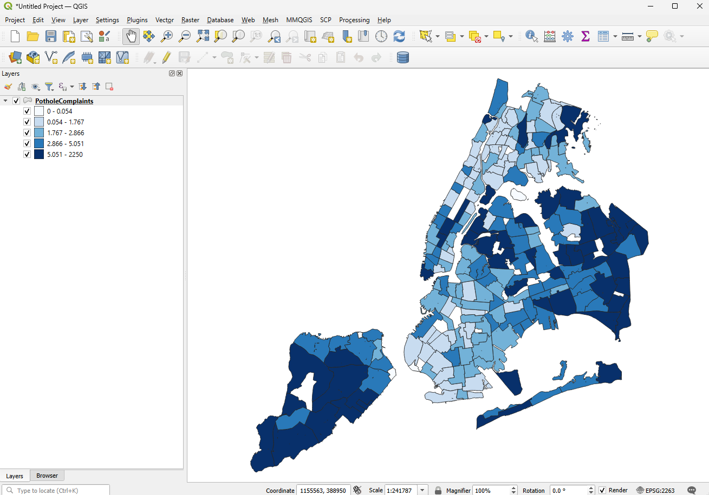

## Data and companion files

Pre-packaged data (in case you want to skip the download/cleanup steps above) is in the [data folder](data). The same analysis is also available as companion scripts in [R](PotholeWorkshop.R) and [Python](PotholeWorkshop.py).
